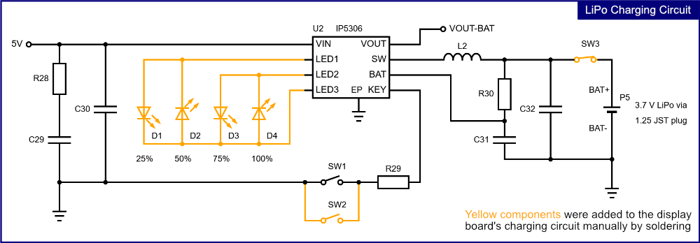
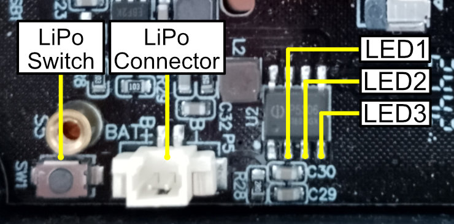
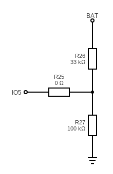

# ESP32-JC3248W535-Micropython-LVGL

## Description
This repo is about running LVGL under MicroPython on the **JC3248W535** aka Cheap Black Display (CBD).
The **JC3248W535** is like a more powerful version of the [Esp32-S2432028R aka Ceap Yellow Display](https://github.com/de-dh/ESP32-Cheap-Yellow-Display-Micropython-LVGL/tree/main).

The firware was compiled from / includes:
- [Kdschlosser's Micropython Bindings](https://github.com/lvgl-micropython/lvgl_micropython) - LVGL9 bindings for Micropython.
- [Straga's MicroPython LCD Display Project](https://github.com/straga/micropython_lcd/) - LCD axs15231b QSPI and Touch axs15231b I2C driver.


The firmware was compiled from lvgl_micropython commit [af5263c](https://github.com/lvgl-micropython/lvgl_micropython/commit/af5263c7c0618ebd791e1fe2904fde9bb6234e7c). 
Newer versions include breaking changes regarding the USB connection.
Straga's new SPI driver (kdschlosser/lvgl_micropython#456) which allows 90° rotation and the touch fix (kdschlosser/lvgl_micropython#454) for correct touch calibration were included.

Them following build and flash commands were used (see [here](https://github.com/straga/micropython_lcd/tree/master/device/JC3248W535)):

```shell
# build
python make.py esp32 BOARD=ESP32_GENERIC_S3 BOARD_VARIANT=SPIRAM_OCT --flash-size=16

# flash
python -m esptool --chip esp32s3 --port COM7 -b 460800 --before default_reset --after hard_reset write_flash --flash_mode dio --flash_size 16MB --flash_freq 80m --erase-all 0x0 lvgl_micropy_ESP32_GENERIC_S3-SPIRAM_OCT-16_NEW_SPI.bin
```

## Instructions

1. Flash the firmware.
2. Upload the `/lib` folder and the test programs `test_landscape_mode.py` and `test_portrait_mode.py` to the device.
3. Run the test programs.


## Using The Onboard LiPo Charger

> [!NOTE]
> None of the shown modifications (yellow parts in the circuit diagramm) are neccessary to operate the LiPo charging circuit. 
> It will work out of the box although the state of the battery can't be determined without the indicator LEDs **D1**–**D4**.
> The additional components were added for convenient integration of the CBD in a case.

The CBD has an onboard power management IC (**IP5306**) which allows the charging and discharging of LiPo batteries.
A 3.7 V LiPo battery can be connected directly to the Cheap Black Display via the JST (2P 1.25 mm JST) terminal **P5**.
Make sure the battery is attached with the correct polarity (my JST connection wires are colored the wrong way).

**SW1** / **SW2** activate the battery interface when the CBD is not connected to another power source.
If a sufficiently charged battery is attached to the board, pressing **SW1** / **SW2** will power it on.

The **IP5306 IC** is designed for use in power banks. As a result, the battery interface automatically shuts down after a timeout if no current is being drawn.
To turn off the display immediately in battery mode, the battery must be briefly disconnected from the circuit using **SW3**.
Note that **SW3** is a normally closed switch.

LEDs **D1**–**D4** indicate the charging level in 25% steps during charging via USB and during discharge when the device is operating on battery power.

For easier integration into a case, LEDs **D1**–**D4**, **SW2**, and **SW3** were mounted on the CBD board with long connecting wires.
The CBD itself was installed in a small case that also houses the LiPo battery and includes an external reset button for convenient operation.

The following figures show the circuit diagram of the charging circuit with added LEDs and switches and the positions of the **IP5306 IC**'s LED pins on the backside of the CBD.

The circuit diagrams from the manufacturer's documentation suggest that IO5 is connected to the battery via a resistive divider as shown in the last figure below.
This has yet to be tested but it might allow to read the battery voltage via ADC input.







## Sources

- [JC3248W535EN Charging Circuit](https://github.com/NorthernMan54/JC3248W535EN/blob/main/JC3248W535EN/5-IO%20pin%20distribution/JC3248W535-2.png), accessed on 27.09.25
- [IP5306 Datasheet](https://www.kynix.com/editor_u/pdf/20220117/IP5306.pdf), accessed on 27.09.25
